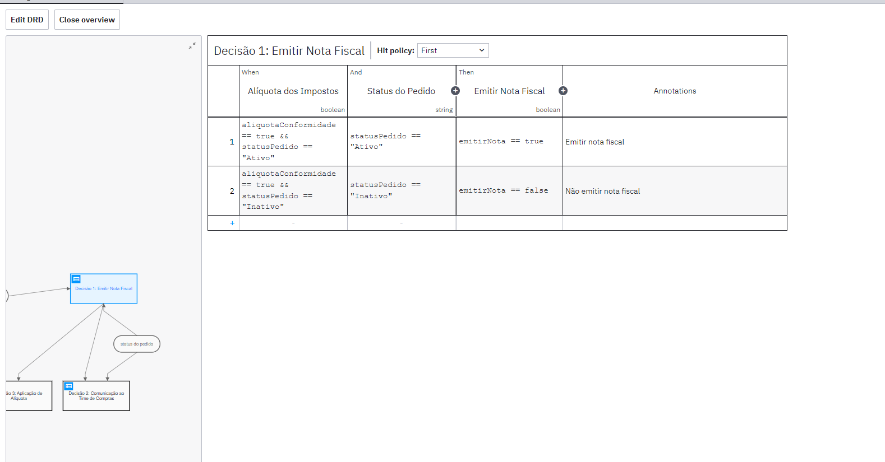

# dmn
 
# Ponderada de DMN

Este documento apresenta as tabelas DMN ponderadas para cada decisão. As tabelas abaixo demonstram os critérios utilizados para a tomada de decisão em diferentes cenários.

## Decisão 1

## Decisão 2

## Decisão 3

## DRD

---

## Regras de Negócio

| Número | Descrição | Critérios de Aplicação | Ações | Responsável |
|--------|-----------|------------------------|-------|-------------|
| IM001  | Política de emissão de notas fiscais | Aplicável a pedidos de emissão de nota fiscal com alíquota de impostos em conformidade. | Emitir nota fiscal se a alíquota dos impostos estiver em conformidade. | Time Contábil |
| IM002  | Política de comunicação do time de compras | Aplicável quando o status de emissão de nota fiscal está temporariamente suspenso. | Comunicar o time de compras sobre a suspensão da emissão de notas fiscais. | Time Contábil |
| IM003  | Política de inserção de imposto de compra de serviço | Aplicável a compras específicas de serviço. | Aplicar alíquota diferenciada em compras específicas de serviços. | Time Contábil |
| IM004  | Política de cancelamento de pagamento de imposto de venda | Aplicável a casos onde a venda foi realizada e posteriormente reembolsada. | Cancelar pagamento de imposto relacionado a venda. | Time Contábil |
| IM005  | Política de recebimento de pedidos inserção de impostos nas notas fiscais | Pedido precisa ser realizado dentro de 5 dias após a análise do time financeiro. | Analisar o pedido e aplicar a regra IM001 | Time Contábil |
